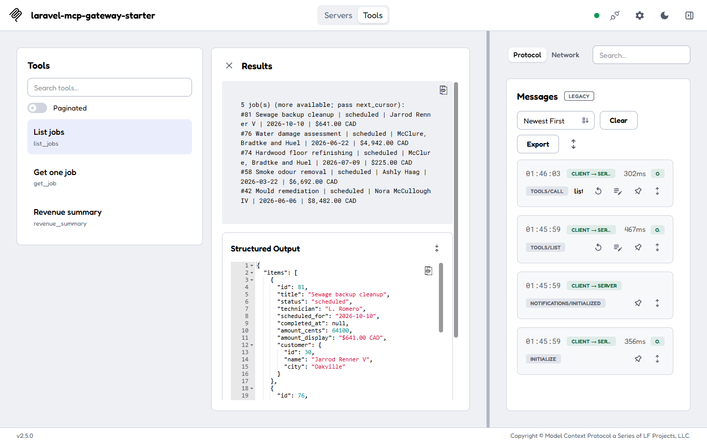
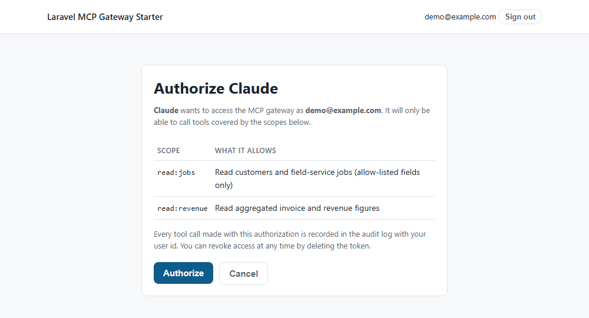
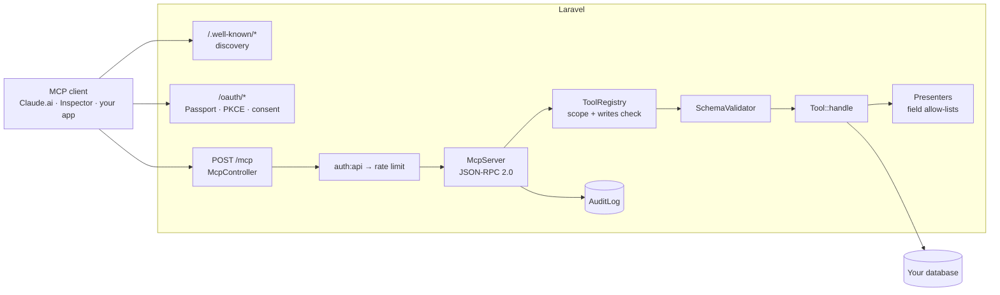

# Laravel MCP Gateway Starter

[](https://github.com/lionking-123/laravel-mcp-gateway-starter/actions/workflows/tests.yml)


A production-shaped starting point for letting an AI assistant (Claude, or any
[Model Context Protocol](https://modelcontextprotocol.io) client) answer
questions from your business data **without ever touching your database**.

The assistant calls a small set of tools you wrote. Each tool has a fixed input
schema, a required OAuth scope, and an allow-list of fields it may return. Every
call is authenticated with OAuth 2.0, rate limited per token, and written to an
audit log. Writes are off until an operator turns them on.



Verified against real clients. MCP Inspector (web) completes the full
registration → login → consent → connected flow and calls tools, as above; the
Inspector CLI does the same from a terminal:

```
$ npx @modelcontextprotocol/inspector --cli --transport http \
    --server-url http://localhost:8000/mcp --header "Authorization: Bearer $TOKEN" \
    --method tools/call --tool-name list_jobs --tool-arg status=completed limit=3

3 job(s) (more available; pass next_cursor):
#77 Water damage assessment | completed | McClure, Bradtke and Huel | 2026-03-19 | $6,489.00 CAD
#73 Hardwood floor refinishing | completed | Justen Brown Sr. | 2026-04-30 | $4,248.00 CAD
#72 Shower regrout | completed | Nella Schowalter | 2026-05-30 | $7,710.00 CAD
```

The consent screen your users see before a client can call anything:



## What you get

- **Laravel 12 + Passport 13**: OAuth 2.0 authorization-code flow with PKCE,
  dynamic client registration (RFC 7591), and the discovery documents (RFC 9728,
  RFC 8414) that MCP clients such as Claude.ai use to find and connect to you.
- **An MCP server endpoint** at `POST /mcp` speaking the Streamable HTTP
  transport (protocol `2025-06-18`, older revisions negotiated), authenticated
  by the Passport bearer token.
- **A `Tool` abstraction**: name, description, JSON input schema, scope, and a
  `handle()` method. Add a class, register it in one config array, done.
- **Three read tools over a sample schema** (`customers`, `service_jobs`,
  `invoices`, seeded with fake data): `list_jobs`, `get_job`, `revenue_summary`.
  Plus one write tool, `update_job_status`, that is disabled by default and
  shows the human-approval pattern.
- **Scopes**: `read:jobs`, `read:revenue`, `write:jobs`. Tokens only see and
  call tools whose scope they hold.
- **Audit log**: who, which tool, which arguments, outcome, result size, duration.
- **Per-token rate limits**, a consent screen, a status page, 46 tests.
- [GUARDRAILS.md](GUARDRAILS.md): the security design, layer by layer.
- [DEPLOY.md](DEPLOY.md): production checklist, Cloudflare WAF rules, and the
  OAuth-terminating Worker pattern for private origins.

## Quickstart (about five minutes)

Requirements: PHP 8.3+ with `sodium`, `pdo_sqlite`, `openssl`; Composer.

```bash
git clone https://github.com/lionking-123/laravel-mcp-gateway-starter.git
cd laravel-mcp-gateway-starter
composer install
cp .env.example .env
php artisan key:generate
php artisan mcp:setup      # migrate, OAuth keys, demo data, local CLI client
php artisan serve
```

`mcp:setup` creates a demo user (`demo@example.com` / `password`), 30
customers, about 80 jobs and their invoices. Open <http://localhost:8000> for
the status page.

### Try it with curl

```bash
php artisan mcp:token demo@example.com        # prints a bearer token
export TOKEN=...

curl -s http://localhost:8000/mcp \
  -H "Authorization: Bearer $TOKEN" -H "Content-Type: application/json" \
  -d '{"jsonrpc":"2.0","id":1,"method":"tools/list"}'

curl -s http://localhost:8000/mcp \
  -H "Authorization: Bearer $TOKEN" -H "Content-Type: application/json" \
  -d '{"jsonrpc":"2.0","id":2,"method":"tools/call","params":{"name":"revenue_summary","arguments":{"from":"2026-01-01","to":"2026-12-31"}}}'
```

The second call returns both a text rendering and `structuredContent`:

```
Revenue (paid basis) 2026-01-01 to 2026-12-31: $77,888.00 CAD across 16 invoices.
By month:
2026-01: $13,327.00 CAD (2 invoices)
2026-02: $15,129.00 CAD (3 invoices)
...
Outstanding (sent + overdue) as of 2026-12-31: $44,596.50 CAD
```

### Try it with MCP Inspector (full OAuth flow, local)

```bash
npx @modelcontextprotocol/inspector
```

In the Inspector: transport **Streamable HTTP**, URL `http://localhost:8000/mcp`,
then **Open Auth Settings → Quick OAuth Flow**. It registers itself, sends you
to the gateway's login page (use the demo account), shows the consent screen
with the scopes, and comes back connected. **List Tools**, pick `list_jobs`,
run it.

### Try it with Claude.ai

Claude needs a public https URL. For a demo:

```bash
cloudflared tunnel --url http://localhost:8000     # or: ngrok http 8000
```

Put the tunnel origin in `APP_URL`, run `php artisan config:clear`, then in
Claude.ai go to Settings → Connectors → Add custom connector and paste
`https://<tunnel>/mcp`. Claude registers, you sign in and consent, and you can
ask "what was revenue by month this year?" See [DEPLOY.md](DEPLOY.md) for the
Cloudflare WAF rules you will need on a real domain.

## How it fits together



Request path for one `tools/call`:

1. `auth:api` validates the bearer token (Passport). No token: 401 with a
   `WWW-Authenticate` header pointing at the discovery document, which is what
   makes clients start the OAuth flow.
2. `McpRateLimit` checks the per-token minute and day windows.
3. `McpController` decodes one JSON-RPC message (batches are rejected) and
   builds a `ToolContext` (user, scopes, token id, client id, request id).
4. `McpServer` finds the tool in the registry, refuses it if writes are off or
   the scope is missing, validates the arguments against the schema, and runs
   `handle()`.
5. The tool queries through Eloquent and returns rows through a presenter.
6. `AuditLogger` writes the row (fail-closed), and the result goes back as
   `content` + `structuredContent`.

## Adding a tool

```php
<?php

namespace App\Mcp\Tools;

use App\Mcp\Tool;
use App\Mcp\ToolContext;
use App\Mcp\ToolResult;
use App\Models\Customer;

final class CountCustomersByCityTool extends Tool
{
    public function name(): string { return 'count_customers_by_city'; }

    public function scope(): string { return 'read:jobs'; }

    public function description(): string
    {
        return 'Number of customers per city. Returns city names and counts only.';
    }

    public function inputSchema(): array
    {
        return [
            'type' => 'object',
            'properties' => [
                'min_count' => ['type' => 'integer', 'minimum' => 1, 'description' => 'Hide cities below this count.'],
            ],
            'additionalProperties' => false,
        ];
    }

    public function handle(array $arguments, ToolContext $context): ToolResult
    {
        $rows = Customer::query()
            ->selectRaw('city, COUNT(*) as n')
            ->groupBy('city')
            ->having('n', '>=', $arguments['min_count'] ?? 1)
            ->orderByDesc('n')
            ->get()
            ->map(fn ($r) => ['city' => $r->city, 'customers' => (int) $r->n])
            ->all();

        return ToolResult::ok(['cities' => $rows]);
    }
}
```

Then add `App\Mcp\Tools\CountCustomersByCityTool::class` to the `tools` array in
`config/mcp.php`. The registry validates the name and scope at boot; the test
suite's pattern in `tests/Feature/Mcp/ToolsTest.php` shows how to prove a
sensitive column never appears in the output.

Rules of thumb (the long version is in [GUARDRAILS.md](GUARDRAILS.md)):

- `additionalProperties: false` and bounds on every argument.
- Rows go through a presenter. Never `toArray()` a model into a result.
- Paginate or aggregate. Cap `limit`.
- Tool-level failures (`not_found`, `invalid_range`) use `$this->fail()` so the
  model gets a readable `isError` result and can recover.

## Scopes and writes

| Scope | Allows |
|---|---|
| `read:jobs` | `list_jobs`, `get_job` |
| `read:revenue` | `revenue_summary` |
| `write:jobs` | `update_job_status` (only when `MCP_WRITES_ENABLED=true`) |

`tools/list` returns only the tools the current token may call. Write tools are
hidden and inert until the environment flag is set; the flag cannot be changed
by a request.

## Configuration

All knobs live in `config/mcp.php` and are driven by `.env`:

| Variable | Default | Purpose |
|---|---|---|
| `MCP_WRITES_ENABLED` | `false` | Expose and allow write tools |
| `MCP_RATE_PER_MINUTE` / `MCP_RATE_PER_DAY` | `60` / `5000` | Per-token limits |
| `MCP_AUDIT_ENABLED` | `true` | Write audit rows (fail-closed) |
| `MCP_AUDIT_LOG_ARGUMENTS` | `true` | Store tool arguments in the audit row |
| `MCP_AUDIT_RETENTION_DAYS` | `90` | Pruned daily by `mcp:audit:prune` |
| `MCP_ACCESS_TOKEN_TTL_MINUTES` | `60` | Access token lifetime |
| `MCP_REFRESH_TOKEN_TTL_DAYS` | `30` | Refresh token lifetime |
| `MCP_DYNAMIC_REGISTRATION` | `true` | Allow RFC 7591 client registration |
| `MCP_ALLOWED_REDIRECT_HOSTS` | *(any https)* | Restrict OAuth redirect hosts |

## Artisan commands

| Command | Purpose |
|---|---|
| `mcp:setup [--fresh]` | Migrate, generate keys, seed demo data, create the CLI client |
| `mcp:token {email} [--scopes=] [--name=]` | Mint a personal access token for curl |
| `mcp:audit:prune [--days=]` | Delete audit rows past retention |

## Project layout

```
app/Mcp/
  Tool.php              abstract tool: name, description, schema, scope, handle()
  ToolContext.php       who is calling (user, scopes, token, client, request id)
  ToolResult.php        ok()/error() → content + structuredContent
  ToolRegistry.php      the catalogue; scope + writes filtering
  McpServer.php         JSON-RPC: initialize, ping, tools/list, tools/call
  SchemaValidator.php   dependency-free JSON Schema subset
  Audit/AuditLogger.php
  Presenters/           field allow-lists per model
  Tools/                ListJobsTool, GetJobTool, RevenueSummaryTool, UpdateJobStatusTool
app/Http/Controllers/
  Mcp/McpController.php             Streamable HTTP transport (stateless)
  OAuth/MetadataController.php      RFC 9728 + RFC 8414 discovery
  OAuth/DynamicClientRegistrationController.php   RFC 7591, public clients only
  Auth/LoginController.php          minimal session login (replace with yours)
app/Http/Middleware/McpRateLimit.php
config/mcp.php
routes/mcp.php          discovery, registration, /mcp
resources/views/oauth/authorize.blade.php   consent screen
tests/                  46 feature + unit tests
```

## Running the tests

```bash
php artisan test
vendor/bin/pint --test
```

## Non-goals

- Server-initiated streams and sessions. The transport is the stateless
  variant of Streamable HTTP: `GET /mcp` answers 405, `DELETE /mcp` is a no-op.
  Long-running tools that need progress notifications would add them here.
- Resources and prompts. Only `tools/*` is implemented; the `McpServer::handle`
  match is the place to add more.
- Being a package. This is an application skeleton you fork per client, not a
  Composer dependency. That is deliberate: every deployment ends up with its
  own tools, presenters and login.

## Background

I built the pattern behind this repository for a Canadian restoration company's
operations platform, where managers now ask an assistant about pipeline and
revenue instead of waiting for a developer. The case study is at
[claritee.online](https://claritee.online). If you want the same over your own
systems, I do fixed-price builds: rick@claritee.online.

## License

MIT. See [LICENSE](LICENSE).
